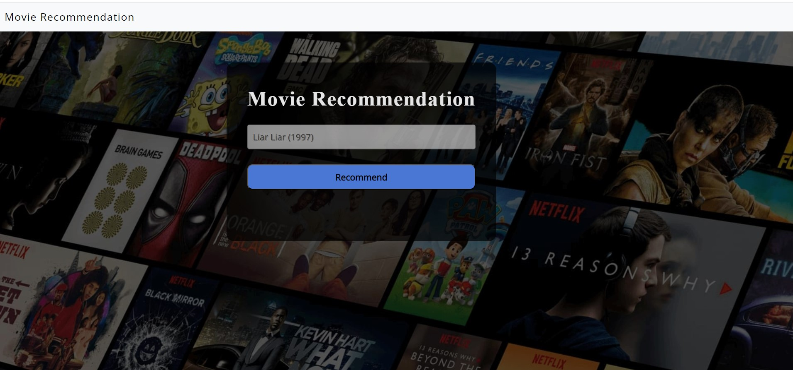
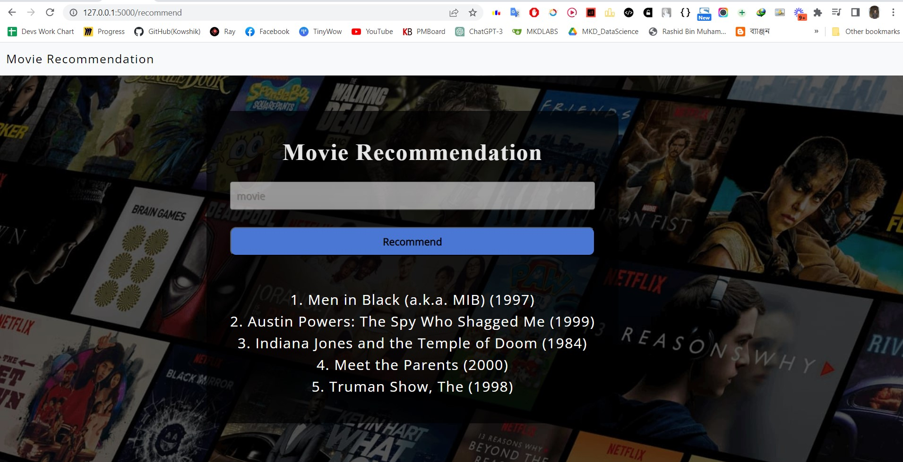

# 🎬 Movie Recommendation Using Flask 🍿

This is a simple movie recommendation system built using Flask.

## Installation

1. Clone the repository:

   ```
   git clone https://github.com/kowshik24/Movie-Recommendation-Using-Flask.git
   ```

2. Install the required libraries:

   ```
   pip install -r requirements.txt
   ```

## Usage

1. Run the Flask app:

   ```
   python app.py
   ```

2. Open your web browser and navigate to `http://localhost:5000`.

3. Enter a movie name and click the "Get Recommendations" button to get a list of recommended movies.

## Demo





## Author

Kowshik Deb Nath

Contact: kowshikcseruet1998@gmail.com

I hope this helps! Let me know if you have any other questions.
